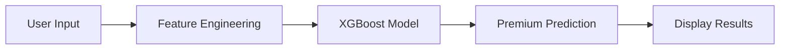

<div align="center">

# 🏥 Healthcare Premium Prediction


### *An intelligent machine learning system to predict health insurance premiums based on individual health and demographic factors*

[](https://www.python.org/)
[](https://scikit-learn.org/)
[](https://xgboost.readthedocs.io/)
[](https://pandas.pydata.org/)
[](https://streamlit.io/)

[Features](#-features) • [Demo](#-demo) • [Installation](#-installation) • [Usage](#-usage) • [Technologies](#️-technologies) • [Contributing](#-contributing)

</div>

---

## 📋 Overview

The **Healthcare Premium Prediction** system leverages advanced machine learning algorithms to accurately predict health insurance costs. By analyzing multiple factors including age, medical history, lifestyle, and demographics, it helps:

- 🏢 **Insurance companies** optimize pricing strategies
- 👥 **Individuals** estimate their insurance premiums accurately
- 📊 **Analysts** understand premium determinants

---

## ✨ Features

<table>
<tr>
<td width="50%">

### 🎯 **Accurate Predictions**
ML-powered cost estimation using XGBoost algorithm for precise results

### 📊 **Multi-factor Analysis**
Considers 12+ parameters for comprehensive assessment

### 🎨 **User-friendly Interface**
Clean, intuitive web interface built with Streamlit

</td>
<td width="50%">

### ⚡ **Real-time Calculation**
Instant premium predictions with a single click

### 📈 **Data-driven Insights**
Based on extensive historical insurance data

### 🔒 **Privacy-focused**
No personal data storage or tracking

</td>
</tr>
</table>

---

## 🖥️ Demo

<div align="center">


### **Comprehensive Input Parameters**


</div>

### 📝 Input Categories

| Category | Features |
|----------|----------|
| 👤 **Demographics** | Age, Gender, Marital Status, Region |
| 🏥 **Health Metrics** | BMI Category, Medical History, Genetic Risk |
| 🚬 **Lifestyle** | Smoking Status, Employment Status |
| 💰 **Financial** | Income, Number of Dependents |
| 📋 **Coverage** | Insurance Plan Type (Bronze/Silver/Gold) |

---

## 🚀 Installation

### Prerequisites

```bash
Python 3.8 or higher
pip package manager
```

### Quick Start

```bash
# 1. Clone the repository
git clone https://github.com/tarunmehrda/Healthcare-Premium-Prediction-Python-Scikit-learn-Pandas-XGBoost.git

# 2. Navigate to project directory
cd Healthcare-Premium-Prediction-Python-Scikit-learn-Pandas-XGBoost

# 3. Install dependencies
pip install -r requirements.txt

# 4. Run the application
streamlit run main.py
```

### 🌐 Access the Application

Open your browser and navigate to: **http://localhost:8501**

---

## 💡 Usage

### Example Prediction

```python
# Sample Input Parameters
age = 18
dependents = 0
income = 0
genetic_risk = 0
insurance_plan = "Bronze"
employment_status = "Freelancer"
gender = "Male"
marital_status = "Married"
bmi_category = "Overweight"
smoking_status = "Regular"
region = "Northwest"
medical_history = "High blood pressure"

# Output
predicted_cost = 5475  # Annual premium in currency units
```

### 🎯 How It Works



---

## 📊 Model Architecture

### Machine Learning Pipeline

```
📥 Data Collection → 🔧 Feature Engineering → 🤖 Model Training → ✅ Validation → 🚀 Deployment
```

### Algorithms & Tools

<table>
<tr>
<td align="center" width="25%">
<br/>
<b>Scikit-learn</b><br/>
Preprocessing & Scaling
</td>
<td align="center" width="25%">
<br/>
<b>XGBoost</b><br/>
Primary Prediction Model
</td>
<td align="center" width="25%">
<br/>
<b>Pandas</b><br/>
Data Manipulation
</td>
<td align="center" width="25%">
<br/>
<b>Streamlit</b><br/>
Web Interface
</td>
</tr>
</table>

### 📈 Model Performance

- ✅ **High Accuracy**: Validated on extensive datasets
- 📊 **12+ Features**: Carefully selected parameters
- ⚙️ **Optimized**: Hyperparameter tuning for best results
- 🎯 **Robust**: Handles diverse input scenarios

---

## 📁 Project Structure

```
Healthcare-Premium-Prediction/
│
├── 📄 main.py                    # Streamlit application
├── 🔮 prediction_helper.py       # ML model & prediction logic
├── 📦 artifacts/                 # Saved models & encoders
│   ├── model.pkl
│   └── encoders/
├── ⚙️ .idea/                     # IDE configuration
├── 🗂️ __pycache__/               # Python cache
├── 📋 requirements.txt           # Python dependencies
└── 📖 README.md                  # Documentation
```

---

## 🛠️ Technologies

<div align="center">

| Technology | Purpose | Version |
|:----------:|---------|:-------:|
|  | Core Language | 3.8+ |
|  | ML Framework | Latest |
|  | Gradient Boosting | Latest |
|  | Data Analysis | Latest |
|  | Web Interface | Latest |

</div>

---

## 🤝 Contributing

Contributions make the open-source community an amazing place to learn and create! Any contributions you make are **greatly appreciated**.

### How to Contribute

1. 🍴 Fork the Project
2. 🌿 Create your Feature Branch
   ```bash
   git checkout -b feature/AmazingFeature
   ```
3. 💾 Commit your Changes
   ```bash
   git commit -m 'Add some AmazingFeature'
   ```
4. 📤 Push to the Branch
   ```bash
   git push origin feature/AmazingFeature
   ```
5. 🔃 Open a Pull Request

---

## 📝 License

This project is licensed under the **MIT License** - see the [LICENSE](LICENSE) file for details.

---

## 👨‍💻 Author

<div align="center">

### **Tarun Mehrda**

[](https://github.com/tarunmehrda)
[](https://www.linkedin.com/in/tarunmehrda)

</div>

---

## 🙏 Acknowledgments

- 🏥 Healthcare insurance industry data providers
- 💻 Open-source ML community
- 🤝 Contributors and testers
- 📚 Python and ML libraries maintainers

---

<div align="center">

### 💝 Made with ❤️ by Tarun Mehrda

#### ⭐ **Star this repository if you find it helpful!** ⭐

[](https://github.com/tarunmehrda/Healthcare-Premium-Prediction-Python-Scikit-learn-Pandas-XGBoost)

---


</div>
